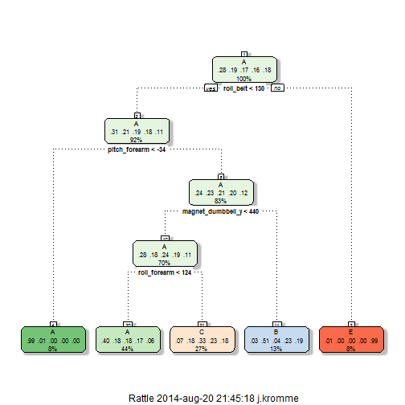
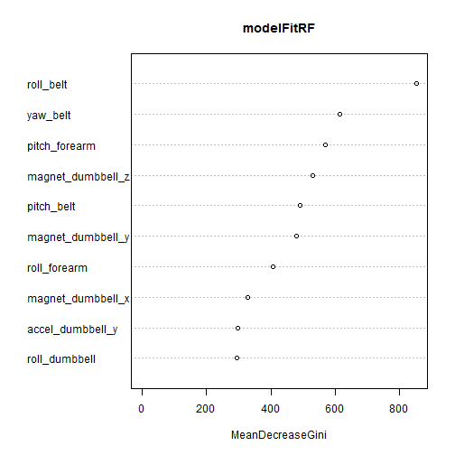

# -------------------------------------------------------------------- #
# ----            Coursera: Practical Machine Learning            ---- #
# -------------------------------------------------------------------- #

Author = J.Kromme
Date = 20-8-2014

This document is part of the Coursera course Practical Machine Learning hosted by John Hopkins Bloomberg School of Public health. Given by Jeff Leek, PhD, Roger D. Peng, PhD, Brian Caffo, PhD.

6 Persons performed barbell lifts correctly and incorrectly while wearing accelerometers on the belt, forarm, arm and dumbell. The dependent variable is a factor with five levels: A, B, C, D and E. The task for this assignment is to predict, using the given data, whether the barbell lift was done correctly or not. To evaluate the outcome of our analysis we got, besides a trainingset, a testset containing 20 cases. My result was 20 out of 20 correct! To evaluate within this assignment, I split the trainingset in a trainingset and a holdoutset (called: validationset).

Data was provides by the university, source:  http://groupware.les.inf.puc-rio.br/har.

First, load the need packages. 

```r
# ---- Load packages ---- #
rm(list=ls())
set.seed(1234)
library(caret)
```

```
## Loading required package: lattice
## Loading required package: ggplot2
```

```r
library(splines)
library(ggplot2)
library(rattle)
```

```
## Rattle: A free graphical interface for data mining with R.
## Version 3.1.0 Copyright (c) 2006-2014 Togaware Pty Ltd.
## Type 'rattle()' to shake, rattle, and roll your data.
```

```r
library(rpart)
library(rpart.plot)
library(klaR)
```

```
## Loading required package: MASS
```

```r
library(foreach)
library(doParallel)
```

```
## Loading required package: iterators
## Loading required package: parallel
```

```r
library(randomForest)
```

```
## randomForest 4.6-7
## Type rfNews() to see new features/changes/bug fixes.
```

The files are read and the trainingset is split into two set: trainingset and validationset. The files contained the values '#DIV/0!', these are excluded at reading in the data.


```r
# ---- Load data ---- #
# load data
# some '#DIV/0!' appears in data, delete those by reading in data
trainingset <- read.csv('./data/training.csv', na.strings = c('#DIV/0!', 'NA') )
testset <- read.csv('./data/test.csv', na.strings = c('#DIV/0!', 'NA') )

# partition train into train / validation set. to validate model as testset doesn't have a DV.
inTrain <- createDataPartition(trainingset[,1], p=0.7, list= FALSE)
trainingset <- trainingset[inTrain,]
validationset <-trainingset[-inTrain,]

# backup data
trainingsetBackup <- trainingset
testsetBackup     <- testset
validationsetBackup <- validationset
```


Data preparation is needed. First all columns where more then 60% of the values are missing are deleted. Also the first seven variables are deleted due to theoretical reasons, for example, you don't want to use an ID number of who is doing the execise as a predictor variable. Furthermore, I looked at NZV-variables, they did not exist. I also looked at histograms of all variables, I commented them out in this document otherwise there would be an overload of redundant graphs. But it did show some that some variables are highly skewed, or consists of two normal distributions. The featureplot confirmed this. This indicates non-linear effects.

```r
# ---- Data preparation ---- #
#summary(trainingset)

# -- missing values
# so many missing values, imputing won't help. therefore delete these
toBeDeleted = list()
for (col in 1:ncol(trainingset)){
  # for each column, count number of missing values
  noOfMissingValues = length(trainingset[!complete.cases(trainingset[,col]),col])
  # if 40% or more is missing, delete variable from traing and testset
  if (noOfMissingValues > nrow(trainingset) * 0.4){
    
    cat('delete due to too many missing values:', names(trainingset)[col], '\n')
    toBeDeleted = c(toBeDeleted, names(trainingset)[col])
  }
}
```

```
## delete due to too many missing values: kurtosis_roll_belt 
## delete due to too many missing values: kurtosis_picth_belt 
## delete due to too many missing values: kurtosis_yaw_belt 
## delete due to too many missing values: skewness_roll_belt 
## delete due to too many missing values: skewness_roll_belt.1 
## delete due to too many missing values: skewness_yaw_belt 
## delete due to too many missing values: max_roll_belt 
## delete due to too many missing values: max_picth_belt 
## delete due to too many missing values: max_yaw_belt 
## delete due to too many missing values: min_roll_belt 
## delete due to too many missing values: min_pitch_belt 
## delete due to too many missing values: min_yaw_belt 
## delete due to too many missing values: amplitude_roll_belt 
## delete due to too many missing values: amplitude_pitch_belt 
## delete due to too many missing values: amplitude_yaw_belt 
## delete due to too many missing values: var_total_accel_belt 
## delete due to too many missing values: avg_roll_belt 
## delete due to too many missing values: stddev_roll_belt 
## delete due to too many missing values: var_roll_belt 
## delete due to too many missing values: avg_pitch_belt 
## delete due to too many missing values: stddev_pitch_belt 
## delete due to too many missing values: var_pitch_belt 
## delete due to too many missing values: avg_yaw_belt 
## delete due to too many missing values: stddev_yaw_belt 
## delete due to too many missing values: var_yaw_belt 
## delete due to too many missing values: var_accel_arm 
## delete due to too many missing values: avg_roll_arm 
## delete due to too many missing values: stddev_roll_arm 
## delete due to too many missing values: var_roll_arm 
## delete due to too many missing values: avg_pitch_arm 
## delete due to too many missing values: stddev_pitch_arm 
## delete due to too many missing values: var_pitch_arm 
## delete due to too many missing values: avg_yaw_arm 
## delete due to too many missing values: stddev_yaw_arm 
## delete due to too many missing values: var_yaw_arm 
## delete due to too many missing values: kurtosis_roll_arm 
## delete due to too many missing values: kurtosis_picth_arm 
## delete due to too many missing values: kurtosis_yaw_arm 
## delete due to too many missing values: skewness_roll_arm 
## delete due to too many missing values: skewness_pitch_arm 
## delete due to too many missing values: skewness_yaw_arm 
## delete due to too many missing values: max_roll_arm 
## delete due to too many missing values: max_picth_arm 
## delete due to too many missing values: max_yaw_arm 
## delete due to too many missing values: min_roll_arm 
## delete due to too many missing values: min_pitch_arm 
## delete due to too many missing values: min_yaw_arm 
## delete due to too many missing values: amplitude_roll_arm 
## delete due to too many missing values: amplitude_pitch_arm 
## delete due to too many missing values: amplitude_yaw_arm 
## delete due to too many missing values: kurtosis_roll_dumbbell 
## delete due to too many missing values: kurtosis_picth_dumbbell 
## delete due to too many missing values: kurtosis_yaw_dumbbell 
## delete due to too many missing values: skewness_roll_dumbbell 
## delete due to too many missing values: skewness_pitch_dumbbell 
## delete due to too many missing values: skewness_yaw_dumbbell 
## delete due to too many missing values: max_roll_dumbbell 
## delete due to too many missing values: max_picth_dumbbell 
## delete due to too many missing values: max_yaw_dumbbell 
## delete due to too many missing values: min_roll_dumbbell 
## delete due to too many missing values: min_pitch_dumbbell 
## delete due to too many missing values: min_yaw_dumbbell 
## delete due to too many missing values: amplitude_roll_dumbbell 
## delete due to too many missing values: amplitude_pitch_dumbbell 
## delete due to too many missing values: amplitude_yaw_dumbbell 
## delete due to too many missing values: var_accel_dumbbell 
## delete due to too many missing values: avg_roll_dumbbell 
## delete due to too many missing values: stddev_roll_dumbbell 
## delete due to too many missing values: var_roll_dumbbell 
## delete due to too many missing values: avg_pitch_dumbbell 
## delete due to too many missing values: stddev_pitch_dumbbell 
## delete due to too many missing values: var_pitch_dumbbell 
## delete due to too many missing values: avg_yaw_dumbbell 
## delete due to too many missing values: stddev_yaw_dumbbell 
## delete due to too many missing values: var_yaw_dumbbell 
## delete due to too many missing values: kurtosis_roll_forearm 
## delete due to too many missing values: kurtosis_picth_forearm 
## delete due to too many missing values: kurtosis_yaw_forearm 
## delete due to too many missing values: skewness_roll_forearm 
## delete due to too many missing values: skewness_pitch_forearm 
## delete due to too many missing values: skewness_yaw_forearm 
## delete due to too many missing values: max_roll_forearm 
## delete due to too many missing values: max_picth_forearm 
## delete due to too many missing values: max_yaw_forearm 
## delete due to too many missing values: min_roll_forearm 
## delete due to too many missing values: min_pitch_forearm 
## delete due to too many missing values: min_yaw_forearm 
## delete due to too many missing values: amplitude_roll_forearm 
## delete due to too many missing values: amplitude_pitch_forearm 
## delete due to too many missing values: amplitude_yaw_forearm 
## delete due to too many missing values: var_accel_forearm 
## delete due to too many missing values: avg_roll_forearm 
## delete due to too many missing values: stddev_roll_forearm 
## delete due to too many missing values: var_roll_forearm 
## delete due to too many missing values: avg_pitch_forearm 
## delete due to too many missing values: stddev_pitch_forearm 
## delete due to too many missing values: var_pitch_forearm 
## delete due to too many missing values: avg_yaw_forearm 
## delete due to too many missing values: stddev_yaw_forearm 
## delete due to too many missing values: var_yaw_forearm
```

```r
trainingset <- trainingset[,!names(trainingset) %in% toBeDeleted]
testset <- testset[,!names(testset) %in% toBeDeleted]
validationset <- validationset[,!names(validationset) %in% toBeDeleted]


#summary(trainingset) # no missing values left

# check variable types
#str(trainingset) # correct

# delete due to theoretical reasons: row number and username etc won't explain useful variance. so exclude from model
trainingset <- trainingset[,-c(1:7)]
testset <- testset[,-c(1:7)]
validationset<- validationset[,-c(1:7)]

# delete variables with near zero variance
nearZeroVar(trainingset[,-53], saveMetrics = TRUE) # no variables with NZV
```

```
##                      freqRatio percentUnique zeroVar   nzv
## roll_belt                1.080        8.1744   FALSE FALSE
## pitch_belt               1.046       12.4836   FALSE FALSE
## yaw_belt                 1.081       12.9422   FALSE FALSE
## total_accel_belt         1.079        0.2111   FALSE FALSE
## gyros_belt_x             1.055        0.9390   FALSE FALSE
## gyros_belt_y             1.156        0.5023   FALSE FALSE
## gyros_belt_z             1.109        1.1865   FALSE FALSE
## accel_belt_x             1.011        1.1647   FALSE FALSE
## accel_belt_y             1.108        1.0118   FALSE FALSE
## accel_belt_z             1.071        2.1328   FALSE FALSE
## magnet_belt_x            1.116        2.2492   FALSE FALSE
## magnet_belt_y            1.139        2.0309   FALSE FALSE
## magnet_belt_z            1.057        3.2319   FALSE FALSE
## roll_arm                56.163       17.4334   FALSE FALSE
## pitch_arm               96.640       20.0830   FALSE FALSE
## yaw_arm                 30.570       19.1731   FALSE FALSE
## total_accel_arm          1.013        0.4731   FALSE FALSE
## gyros_arm_x              1.000        4.6004   FALSE FALSE
## gyros_arm_y              1.510        2.6714   FALSE FALSE
## gyros_arm_z              1.097        1.7251   FALSE FALSE
## accel_arm_x              1.050        5.5612   FALSE FALSE
## accel_arm_y              1.215        3.8579   FALSE FALSE
## accel_arm_z              1.033        5.6122   FALSE FALSE
## magnet_arm_x             1.050        9.5865   FALSE FALSE
## magnet_arm_y             1.065        6.2527   FALSE FALSE
## magnet_arm_z             1.062        9.0843   FALSE FALSE
## roll_dumbbell            1.055       86.4900   FALSE FALSE
## pitch_dumbbell           2.333       84.2117   FALSE FALSE
## yaw_dumbbell             1.079       85.8931   FALSE FALSE
## total_accel_dumbbell     1.073        0.2984   FALSE FALSE
## gyros_dumbbell_x         1.014        1.7106   FALSE FALSE
## gyros_dumbbell_y         1.268        1.9726   FALSE FALSE
## gyros_dumbbell_z         1.002        1.4194   FALSE FALSE
## accel_dumbbell_x         1.043        2.9771   FALSE FALSE
## accel_dumbbell_y         1.006        3.3047   FALSE FALSE
## accel_dumbbell_z         1.195        2.9189   FALSE FALSE
## magnet_dumbbell_x        1.089        7.7231   FALSE FALSE
## magnet_dumbbell_y        1.238        6.0125   FALSE FALSE
## magnet_dumbbell_z        1.240        4.8479   FALSE FALSE
## roll_forearm            11.386       13.7138   FALSE FALSE
## pitch_forearm           58.391       19.1294   FALSE FALSE
## yaw_forearm             14.137       12.9058   FALSE FALSE
## total_accel_forearm      1.108        0.4950   FALSE FALSE
## gyros_forearm_x          1.013        2.0745   FALSE FALSE
## gyros_forearm_y          1.035        5.2919   FALSE FALSE
## gyros_forearm_z          1.086        2.1109   FALSE FALSE
## accel_forearm_x          1.136        5.6850   FALSE FALSE
## accel_forearm_y          1.097        7.1481   FALSE FALSE
## accel_forearm_z          1.061        4.1272   FALSE FALSE
## magnet_forearm_x         1.109       10.6129   FALSE FALSE
## magnet_forearm_y         1.140       13.3935   FALSE FALSE
## magnet_forearm_z         1.023       11.7266   FALSE FALSE
```

```r
# plot histograms
for (col in 1:(ncol(trainingset) -1)){
  #hist(as.numeric(trainingset[,col]))
  if (col != ncol(trainingset) -1){
    #readline("Please press the Enter")
  }
} # few highly skewed, few with two normal distributions (1 - 4, 10), few with many zero variables

# investigate double distributions further
#featurePlot(x=trainingset[,c(1:4,10)], y = trainingset$classe, plot = 'pairs')

correlations <- abs(cor(trainingset[,c(1:4,10)]))
diag(correlations) <- 0
which(correlations > 0.7, arr.ind = T) # plots and correlation table shows high correlations -> need for PCA as preprocessing proces
```

```
##                  row col
## yaw_belt           3   1
## total_accel_belt   4   1
## accel_belt_z       5   1
## roll_belt          1   3
## total_accel_belt   4   3
## accel_belt_z       5   3
## roll_belt          1   4
## yaw_belt           3   4
## accel_belt_z       5   4
## roll_belt          1   5
## yaw_belt           3   5
## total_accel_belt   4   5
```

The data preparation stage suggested non-linear effects, therefore no regression are used to model the data. Instead, a decision tree and a random forest model are trained. 


```r
# ---- build models ---- #
# -- trees
modelFitTree <- train(trainingset$classe ~., method='rpart', data = trainingset[,-53])
finalModelTree <- modelFitTree$finalModel
modelFitTree
```

```
## CART 
## 
## 13738 samples
##    51 predictors
##     5 classes: 'A', 'B', 'C', 'D', 'E' 
## 
## No pre-processing
## Resampling: Bootstrapped (25 reps) 
## 
## Summary of sample sizes: 13738, 13738, 13738, 13738, 13738, 13738, ... 
## 
## Resampling results across tuning parameters:
## 
##   cp    Accuracy  Kappa  Accuracy SD  Kappa SD
##   0.04  0.5       0.4    0.02         0.02    
##   0.06  0.4       0.3    0.07         0.1     
##   0.1   0.3       0.05   0.04         0.06    
## 
## Accuracy was used to select the optimal model using  the largest value.
## The final value used for the model was cp = 0.04.
```

```r
finalModelTree
```

```
## n= 13738 
## 
## node), split, n, loss, yval, (yprob)
##       * denotes terminal node
## 
##  1) root 13738 9843 A (0.28 0.19 0.17 0.16 0.18)  
##    2) roll_belt< 130.5 12597 8713 A (0.31 0.21 0.19 0.18 0.11)  
##      4) pitch_forearm< -33.95 1133    7 A (0.99 0.0062 0 0 0) *
##      5) pitch_forearm>=-33.95 11464 8706 A (0.24 0.23 0.21 0.2 0.12)  
##       10) magnet_dumbbell_y< 439.5 9677 6973 A (0.28 0.18 0.24 0.19 0.11)  
##         20) roll_forearm< 124.5 6008 3578 A (0.4 0.18 0.18 0.17 0.064) *
##         21) roll_forearm>=124.5 3669 2449 C (0.075 0.18 0.33 0.23 0.18) *
##       11) magnet_dumbbell_y>=439.5 1787  868 B (0.03 0.51 0.041 0.23 0.19) *
##    3) roll_belt>=130.5 1141   11 E (0.0096 0 0 0 0.99) *
```

```r
fancyRpartPlot(finalModelTree)
```

```
## Loading required package: RColorBrewer
```

 

```r
confusionMatrix(trainingset$classe, predict(modelFitTree, newdata = trainingset))
```

```
## Confusion Matrix and Statistics
## 
##           Reference
## Prediction    A    B    C    D    E
##          A 3556   54  274    0   11
##          B 1098  919  661    0    0
##          C 1095   74 1220    0    0
##          D 1005  405  844    0    0
##          E  387  335  670    0 1130
## 
## Overall Statistics
##                                         
##                Accuracy : 0.497         
##                  95% CI : (0.488, 0.505)
##     No Information Rate : 0.52          
##     P-Value [Acc > NIR] : 1             
##                                         
##                   Kappa : 0.343         
##  Mcnemar's Test P-Value : NA            
## 
## Statistics by Class:
## 
##                      Class: A Class: B Class: C Class: D Class: E
## Sensitivity             0.498   0.5143   0.3325       NA   0.9904
## Specificity             0.949   0.8528   0.8839    0.836   0.8895
## Pos Pred Value          0.913   0.3432   0.5107       NA   0.4481
## Neg Pred Value          0.636   0.9215   0.7842       NA   0.9990
## Prevalence              0.520   0.1301   0.2671    0.000   0.0831
## Detection Rate          0.259   0.0669   0.0888    0.000   0.0823
## Detection Prevalence    0.284   0.1949   0.1739    0.164   0.1836
## Balanced Accuracy       0.723   0.6835   0.6082       NA   0.9399
```

```r
confusionMatrix(validationset$classe, predict(modelFitTree, newdata = validationset))
```

```
## Confusion Matrix and Statistics
## 
##           Reference
## Prediction    A    B    C    D    E
##          A 1044   17   99    0    3
##          B  330  292  194    0    0
##          C  304   28  362    0    0
##          D  311  139  241    0    0
##          E  123  109  193    0  328
## 
## Overall Statistics
##                                         
##                Accuracy : 0.492         
##                  95% CI : (0.477, 0.507)
##     No Information Rate : 0.513         
##     P-Value [Acc > NIR] : 0.996         
##                                         
##                   Kappa : 0.338         
##  Mcnemar's Test P-Value : NA            
## 
## Statistics by Class:
## 
##                      Class: A Class: B Class: C Class: D Class: E
## Sensitivity             0.494   0.4991   0.3324       NA   0.9909
## Specificity             0.941   0.8516   0.8904    0.832   0.8877
## Pos Pred Value          0.898   0.3578   0.5216       NA   0.4356
## Neg Pred Value          0.638   0.9112   0.7876       NA   0.9991
## Prevalence              0.513   0.1421   0.2645    0.000   0.0804
## Detection Rate          0.254   0.0709   0.0879    0.000   0.0797
## Detection Prevalence    0.282   0.1982   0.1686    0.168   0.1829
## Balanced Accuracy       0.717   0.6754   0.6114       NA   0.9393
```

```r
# -- random forest - use randomForest package itself which includes combine function for doParallel
cl <- makePSOCKcluster(6)
registerDoParallel(cl)
modelFitRF <- foreach(ntree=rep(50, 6), .combine=randomForest::combine, .packages='randomForest') %dopar% {
 randomForest(trainingset[,-53], trainingset$classe, ntree=ntree)
 
}
stopCluster(cl)

confusionMatrix(trainingset$classe, predict(modelFitRF, newdata = trainingset))
```

```
## Confusion Matrix and Statistics
## 
##           Reference
## Prediction    A    B    C    D    E
##          A 3895    0    0    0    0
##          B    0 2678    0    0    0
##          C    0    0 2389    0    0
##          D    0    0    0 2254    0
##          E    0    0    0    0 2522
## 
## Overall Statistics
##                                 
##                Accuracy : 1     
##                  95% CI : (1, 1)
##     No Information Rate : 0.284 
##     P-Value [Acc > NIR] : <2e-16
##                                 
##                   Kappa : 1     
##  Mcnemar's Test P-Value : NA    
## 
## Statistics by Class:
## 
##                      Class: A Class: B Class: C Class: D Class: E
## Sensitivity             1.000    1.000    1.000    1.000    1.000
## Specificity             1.000    1.000    1.000    1.000    1.000
## Pos Pred Value          1.000    1.000    1.000    1.000    1.000
## Neg Pred Value          1.000    1.000    1.000    1.000    1.000
## Prevalence              0.284    0.195    0.174    0.164    0.184
## Detection Rate          0.284    0.195    0.174    0.164    0.184
## Detection Prevalence    0.284    0.195    0.174    0.164    0.184
## Balanced Accuracy       1.000    1.000    1.000    1.000    1.000
```

```r
confusionMatrix(validationset$classe, predict(modelFitRF, newdata = validationset))
```

```
## Confusion Matrix and Statistics
## 
##           Reference
## Prediction    A    B    C    D    E
##          A 1163    0    0    0    0
##          B    0  816    0    0    0
##          C    0    0  694    0    0
##          D    0    0    0  691    0
##          E    0    0    0    0  753
## 
## Overall Statistics
##                                     
##                Accuracy : 1         
##                  95% CI : (0.999, 1)
##     No Information Rate : 0.282     
##     P-Value [Acc > NIR] : <2e-16    
##                                     
##                   Kappa : 1         
##  Mcnemar's Test P-Value : NA        
## 
## Statistics by Class:
## 
##                      Class: A Class: B Class: C Class: D Class: E
## Sensitivity             1.000    1.000    1.000    1.000    1.000
## Specificity             1.000    1.000    1.000    1.000    1.000
## Pos Pred Value          1.000    1.000    1.000    1.000    1.000
## Neg Pred Value          1.000    1.000    1.000    1.000    1.000
## Prevalence              0.282    0.198    0.169    0.168    0.183
## Detection Rate          0.282    0.198    0.169    0.168    0.183
## Detection Prevalence    0.282    0.198    0.169    0.168    0.183
## Balanced Accuracy       1.000    1.000    1.000    1.000    1.000
```

```r
varImpPlot(modelFitRF, n = 10)
```

 

The random forest model performs far better, therefore this model is used to predict the values in the testset. The values are already submitted and it scored a 20 out of 20 correct. roll_belt is by far the best predictor, followed by yaw_belt, pitch_forearm and magnet_dumbbell_z.


```r
predict(modelFitRF, newdata = testset)
```

```
##  1  2  3  4  5  6  7  8  9 10 11 12 13 14 15 16 17 18 19 20 
##  B  A  B  A  A  E  D  B  A  A  B  C  B  A  E  E  A  B  B  B 
## Levels: A B C D E
```

```r
pml_write_files = function(x){
  n = length(x)
  for(i in 1:n){
    filename = paste0("problem_id_",i,".txt")
    write.table(x[i],file=filename,quote=FALSE,row.names=FALSE,col.names=FALSE)
  }
}

pml_write_files(predict(modelFitRF, newdata = testset))
```
